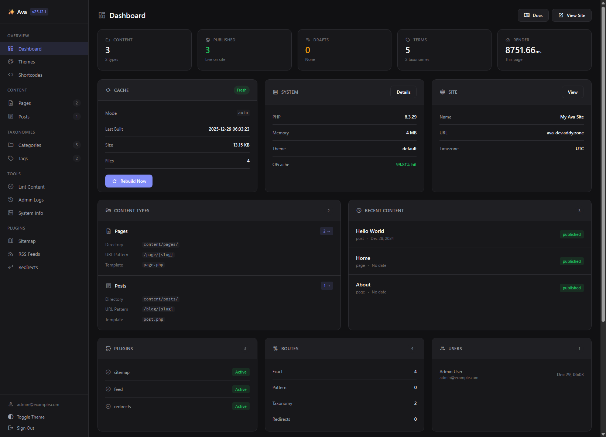

# Admin Dashboard

Ava includes a simple, optional dashboard to help you keep an eye on your site. It's not a full editor—remember, your files are the source of truth—but it's great for discovering more about your setup, learning how to configure and customise Ava as well as checking your site's health.



## What's it for?

Think of the dashboard as a friendly window into your site's engine room:

- **🩺 Health Check** — See if your cache is fresh and your system is happy.
- **📊 Content Overview** — Quickly see how many posts and pages you have.
- **🧹 Linting** — Check your content files for errors (like missing titles or broken links).
- **⚡ Cache Control** — Rebuild your site's cache with a single click.

## Enabling the Dashboard

It's disabled by default. To turn it on, edit `app/config/ava.php`:

```php
'admin' => [
    'enabled' => true,
    'path' => '/admin',   // You can change this to /dashboard or anything else!
],
```

## Creating Your First User

Since there's no database, users are stored in a simple config file. Use the CLI to create one:

```bash
./ava user:add admin@example.com yourpassword "Your Name"
```

This creates a secure `app/config/users.php` file (which is ignored by Git, so your secrets stay safe).

## Features

### Content Linter

This is the most useful feature. It scans all your Markdown files and warns you about:
- Missing required fields (like title or date)
- Invalid status settings
- Duplicate URLs

It's like a spellchecker for your site's structure.

### Cache Manager

If you're making changes and they aren't showing up, the Cache Manager tells you why. You can see if the cache is "Fresh" or "Stale" and rebuild it instantly.

### Theme Inspector

See exactly which theme is active and list all the available templates and assets. It's helpful for debugging if a page isn't looking right.

### Admin Logs

View a log of admin actions — logins, logouts, cache rebuilds, and warnings. Logs are stored in `storage/logs/admin.log` and show:

- Timestamp
- Log level (INFO, WARNING)
- Action description
- IP address

### System Info

Detailed system information including:

- Server load and memory usage
- PHP version and extensions
- Cache status and file counts
- Directory permissions
- Hook registrations

### Content Browser

Browse all content by type. Each item shows:

- Title and slug
- Status (draft, published, private)
- Date (for dated types)
- Quick links to view on site

This is read-only — to edit content, use your text editor and Git.

## Security

The admin dashboard includes several security measures:

| Feature | Description |
|---------|-------------|
| **Bcrypt passwords** | Passwords are hashed with bcrypt, never stored in plain text |
| **CSRF protection** | All forms include CSRF tokens to prevent cross-site attacks |
| **Timing-safe comparison** | Token verification uses constant-time comparison |
| **Session regeneration** | Session ID regenerated on login/logout to prevent fixation |
| **Secure cookies** | Session cookies are HTTP-only with SameSite protection |
| **No file writes** | Dashboard cannot modify content files |

### Recommendations

- Use a strong, unique password
- Consider changing the admin path from `/admin` to something less guessable
- Use HTTPS in production
- Keep `users.php` out of version control (it's gitignored by default)

## Customizing the Path

If you want the admin at a different URL:

```php
'admin' => [
    'enabled' => true,
    'path' => '/dashboard',  // Now at /dashboard
],
```

All admin routes (login, logout, etc.) will be prefixed with this path.

## Disabling the Admin

To disable the dashboard entirely:

```php
'admin' => [
    'enabled' => false,
],
```

This removes all admin routes. The dashboard code still exists but is never loaded.

## Preview Drafts

The admin allows previewing draft content without making it public.

When viewing the content browser, draft items have a "Preview" link. This uses a secure token to temporarily view unpublished content.

You can also preview drafts by adding query parameters:

```
https://yoursite.com/some-draft-post?preview=1&token=YOUR_PREVIEW_TOKEN
```

Set your preview token in `ava.php`:

```php
'security' => [
    'preview_token' => 'your-secret-token-here',
],
```

## Theming

The admin dashboard has its own built-in UI and respects your system's light/dark mode preference by default.

If you prefer to force a theme, you can use the theme toggle inside the admin — it saves your choice (so it sticks between visits) but will fall back to your system preference if you haven’t set anything yet.
